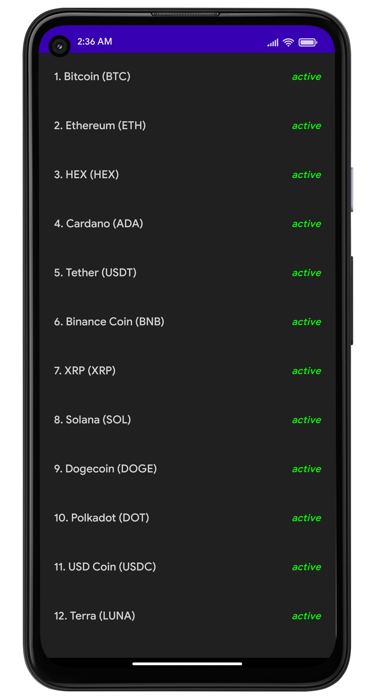
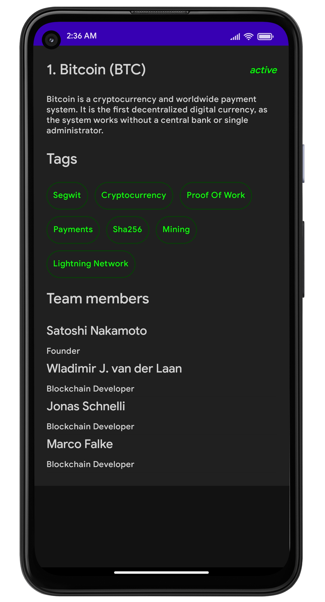

## Cryptocurrency-Info-App-Compose

Display Cryptocurrencies and basic information about them using Data from [Coinpaprika]("https://api.coinpaprika.com/") 
Using Jetpack Compose, Retrofit and following Clean Architecture.

## 📸 Screenshots

||||
|:----------------------------------------:|:-----------------------------------------:|:-----------------------------------------: |
|  |  |

## Built With 🛠
- [Kotlin](https://kotlinlang.org/) - First class and official programming language for Android development.
- [Jetpack Compose](https://developer.android.com/jetpack/compose) - Jetpack Compose is Android's modern toolkit for building native UI.
- [Coroutines](https://kotlinlang.org/docs/reference/coroutines-overview.html) - For asynchronous and more..
- [Retrofit](https://square.github.io/retrofit/)  - A type-safe HTTP client for Android and Java.
- [Flow](https://kotlin.github.io/kotlinx.coroutines/kotlinx-coroutines-core/kotlinx.coroutines.flow/-flow/) - A cold asynchronous data stream that sequentially emits values and completes normally or with an exception.
- [Dagger-Hilt](https://developer.android.com/training/dependency-injection/hilt-android) - Library for Android that reduces the boilerplate of doing manual dependency injection in the project.
- [Android Architecture Components](https://developer.android.com/topic/libraries/architecture) - Collection of libraries that help you design robust, testable, and maintainable apps.
  - [ViewModel](https://developer.android.com/topic/libraries/architecture/viewmodel) - Stores UI-related data that isn't destroyed on UI changes.
- [Material Components for Android](https://github.com/material-components/material-components-android) - Modular and customizable Material Design UI components for Android.

## Architecture
This app uses [***MVVM (Model View View-Model)***](https://developer.android.com/jetpack/docs/guide#recommended-app-arch) architecture.

## Contact
If you need any help, you can connect with me.
-prakash.r19500@gmail.com

## Credits
Phillipp Lackner YouTube Channel
